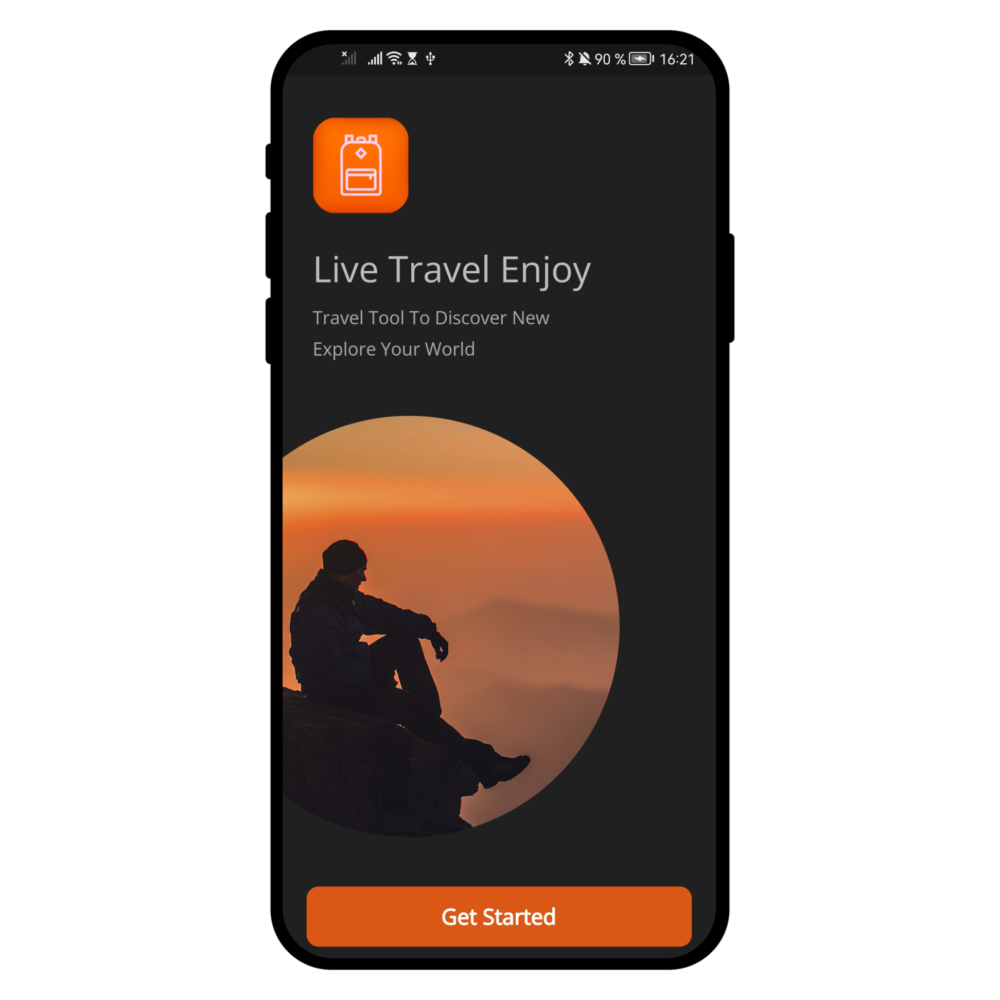
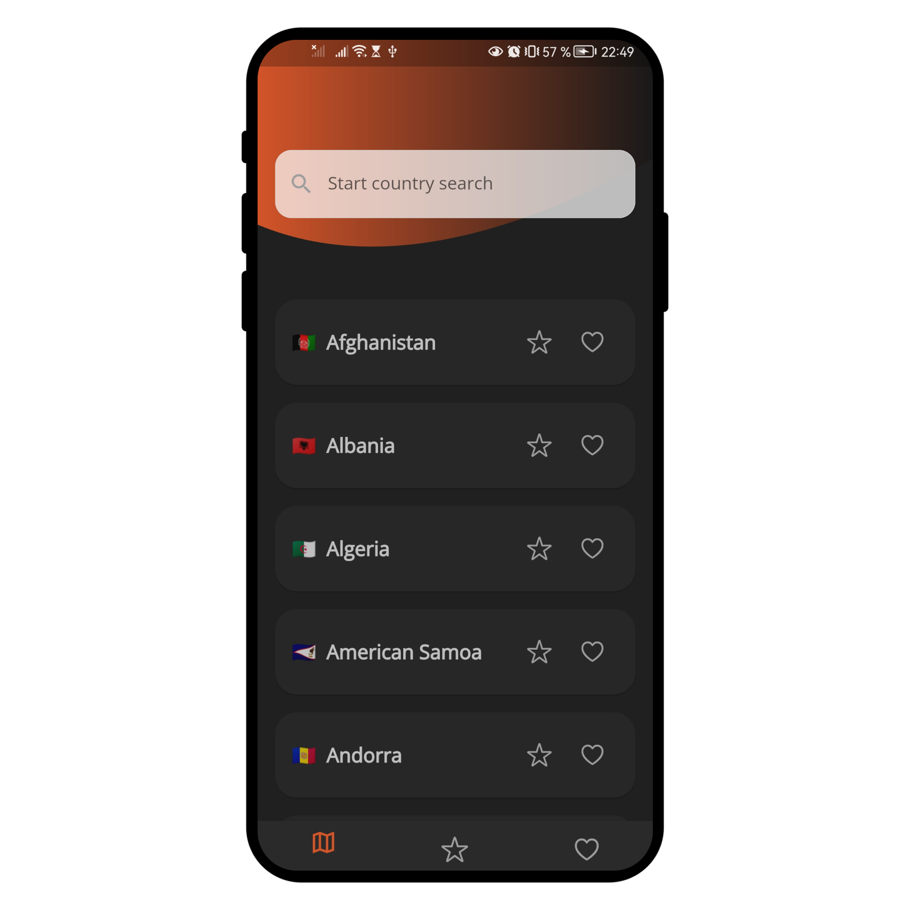

  

# travel_app

This is my first Flutter project made all by myself.

## Discription

This is the app for travelling. You can save the countries you've already visited. It's like to-do list for countries.

# Application features

Already implemented:

- Get started screen
- List of countries
- Two pages (unvisited and visited countries)
- Search AppBar

In development:

- opportunity to save the country you've visited 
- opportunity to note the country you want to visit 
- opportunity to search for a country 
- opportunity to add some discription and photos from visited country 

